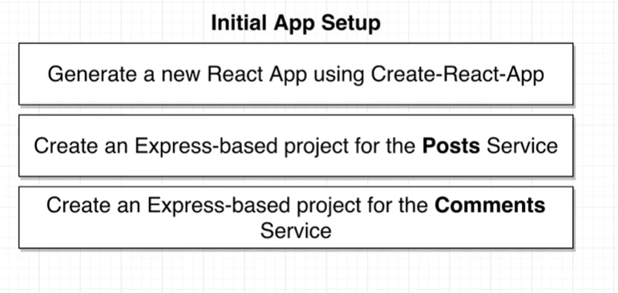

# my-first-microservice

JavaScript microservice project following the very excellent course at https://www.udemy.com/course/microservices-with-node-js-and-react/

## Node Back End

Data structure will be as follows, using random hex strings for unique IDs of posts and comments.

## React Front End

## Async Communication Strategy

<<<<<<< HEAD

=======

>>>>>>> eed849f3cdf0bfccb56967fa57932345dd4dc6b8
